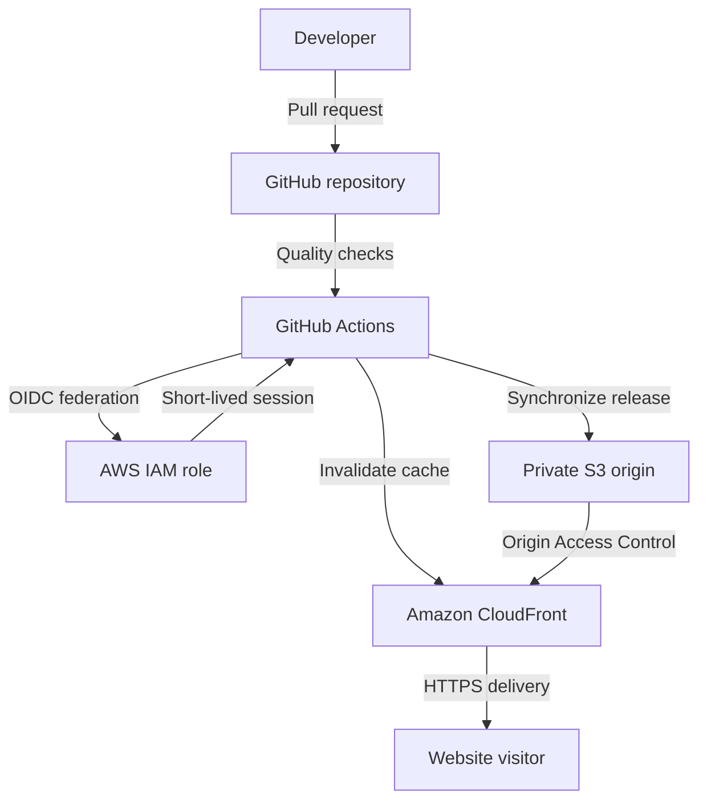

# CloudPipe Secure Website Delivery Pipeline

[](https://github.com/thecloudengineer2026/cloudpipe-deploy/actions/workflows/quality.yml)
[](https://github.com/thecloudengineer2026/cloudpipe-deploy/actions/workflows/deploy.yml)

A secure continuous-delivery implementation for a fictional web development company replacing manual website uploads with automated, validated, and traceable deployments.

**Live application:** [CloudPipe website](https://d1s41t48v8iq7t.cloudfront.net)

**Repository:** [thecloudengineer2026/cloudpipe-deploy](https://github.com/thecloudengineer2026/cloudpipe-deploy)

## Project Summary

CloudPipe is a fictional web development company that previously deployed client websites by manually copying files to production servers.

That process introduced several risks:

- Developers could omit updated files.
- Deployments required repetitive manual work.
- Release consistency depended on individual attention.
- Errors might not be discovered until customers reported them.
- Deployment history and rollback procedures were unclear.

This project replaces that workflow with a secure AWS and GitHub continuous-delivery pipeline.

Website changes are validated through pull requests. Eligible changes merged into `main` automatically authenticate to AWS, synchronize the complete website release, invalidate cached CloudFront content, and verify the public HTTPS endpoint.

## Architecture



## Deployment Flow

1. A developer creates a branch and updates the website.
2. A pull request starts the quality workflow.
3. HTML, CSS, JavaScript, and dependencies are validated.
4. The pull request is reviewed and merged into `main`.
5. GitHub automatically starts the deployment workflow for eligible website changes.
6. GitHub requests an OIDC identity token.
7. AWS validates the token against the repository-bound IAM trust policy.
8. AWS issues short-lived role credentials.
9. GitHub Actions synchronizes the complete `website/` directory to private S3.
10. The workflow creates and monitors a CloudFront invalidation.
11. The public HTTPS endpoint is checked.
12. GitHub records the deployment result and logs.

## Implemented AWS Resources

The CloudFormation template provisions:

- One private Amazon S3 origin bucket
- S3 Block Public Access
- S3 server-side encryption using AES-256
- S3 versioning
- A lifecycle rule for noncurrent object versions
- One Amazon CloudFront distribution
- CloudFront Origin Access Control
- A CloudFront response-headers policy
- An S3 bucket policy restricted to the CloudFront distribution
- A GitHub Actions OIDC identity provider
- A repository-bound IAM deployment role

The website does not use an S3 public website endpoint. CloudFront is the only authorized public delivery path.

## Repository Structure

```text
cloudpipe-deploy/
├── .github/
│   └── workflows/
│       ├── deploy.yml
│       └── quality.yml
├── infrastructure/
│   └── template.yaml
├── website/
│   ├── css/
│   │   └── styles.css
│   ├── js/
│   │   └── app.js
│   ├── error.html
│   └── index.html
├── .gitattributes
├── .gitignore
├── .htmlvalidate.json
├── .nvmrc
├── .stylelintrc.json
├── package-lock.json
├── package.json
└── README.md
```

## Security Design

### Private S3 Origin

The S3 bucket is not publicly accessible.

Validated controls:

- `BlockPublicAcls`: enabled
- `IgnorePublicAcls`: enabled
- `BlockPublicPolicy`: enabled
- `RestrictPublicBuckets`: enabled
- Direct public object request: HTTP `403`
- Server-side encryption: `AES256`
- Versioning: enabled

CloudFront reads objects through Origin Access Control. The bucket policy restricts access to the project distribution.

### HTTPS Delivery

CloudFront is configured with:

- HTTP-to-HTTPS redirection
- `index.html` as the default root object
- Origin Access Control
- Custom handling for `403` and `404` responses
- A CloudFront response-headers policy defined through CloudFormation

### GitHub OIDC Authentication

The deployment pipeline does not store AWS access keys in GitHub.

GitHub Actions authenticates through OpenID Connect and assumes an IAM role using short-lived credentials.

The role trust policy is restricted by:

- OIDC audience
- GitHub organization identity
- Immutable repository identity
- Repository name
- The `main` branch reference

The deployment role is limited to:

- Listing the project bucket
- Reading, writing, and deleting objects in the project bucket
- Creating invalidations for the project CloudFront distribution
- Reading invalidation status for the project distribution

GitHub contains no repository secrets for AWS authentication.

### Repository Variables

The workflow reads non-secret deployment configuration from repository variables:

- `AWS_DEPLOYMENT_ROLE_ARN`
- `AWS_REGION`
- `CLOUDFRONT_DISTRIBUTION_ID`
- `SITE_BUCKET_NAME`
- `WEBSITE_URL`

## Quality Workflow

Pull requests targeting `main` run:

```text
npm ci
npm audit
npm run validate
```

The validation command performs:

- HTML validation with `html-validate`
- CSS validation with `stylelint`
- JavaScript syntax validation with Node.js

The dependency tree was validated with zero known npm vulnerabilities at project completion.

## Deployment Workflow

Eligible pushes to `main` and manual dispatches run the deployment workflow.

The workflow:

1. Checks out the exact commit.
2. Configures Node.js from `.nvmrc`.
3. Installs locked dependencies with `npm ci`.
4. audits dependencies.
5. Validates the website.
6. Confirms required repository variables.
7. Assumes the AWS role through OIDC.
8. Synchronizes `website/` to S3 using `aws s3 sync --delete`.
9. Creates a CloudFront invalidation.
10. Waits for invalidation completion.
11. Verifies the production endpoint.
12. Records a deployment summary.

The `--delete` option ensures production reflects the complete declared release instead of accumulating obsolete files.

## Validation Results

| Validation | Result |
|---|---|
| Responsive desktop layout | Passed |
| Responsive tablet layout | Passed |
| Responsive mobile layout | Passed |
| Navigation testing | Passed |
| Demo form validation | Passed |
| HTML validation | Passed |
| CSS validation | Passed |
| JavaScript syntax validation | Passed |
| npm dependency audit | Passed |
| CloudFormation template validation | Passed |
| CloudFormation change-set review | Passed |
| Stack creation | Passed |
| S3 Block Public Access | Passed |
| S3 encryption | Passed |
| S3 versioning | Passed |
| Direct public S3 request | Blocked with HTTP 403 |
| CloudFront deployment | Passed |
| HTTPS endpoint response | HTTP 200 |
| GitHub OIDC role assumption | Passed |
| S3 synchronization | Passed |
| CloudFront invalidation | Passed |
| Automatic main-branch deployment | Passed |
| Git-based rollback deployment | Passed |
| Post-rollback production verification | Passed |

## Automated Deployment Test

A nonvisual release marker was added to `website/index.html` through a pull request.

After the pull request was merged:

- GitHub automatically triggered the deployment workflow.
- The workflow event was `push`.
- The workflow commit matched the pull-request merge commit.
- All validation and deployment steps passed.
- The production endpoint returned HTTP `200`.
- The release marker appeared in the CloudFront-delivered document.

This demonstrated that a repository change could move from reviewed source code to production without manual file uploading.

## Rollback Test

The release-marker commit was reverted through a new branch and pull request.

After the rollback was merged:

- GitHub automatically triggered another deployment.
- The deployment used the rollback merge commit.
- S3 synchronization completed.
- CloudFront invalidation completed.
- The production endpoint continued returning HTTP `200`.
- Expected CloudPipe content remained available.
- The temporary release marker was absent.

This validated a Git-based application rollback procedure.

It did not test CloudFormation rollback or manual restoration of an individual S3 object version. Those are separate recovery mechanisms.

## Troubleshooting and Lessons Learned

### OIDC Role Assumption Failure

The first automated deployment failed while attempting to assume the AWS role:

```text
Not authorized to perform sts:AssumeRoleWithWebIdentity
```

The CloudFormation template used a folded YAML scalar with:

```yaml
!Sub >
```

That syntax preserved a trailing newline in the OIDC subject.

The deployed value was therefore 84 characters long, while GitHub’s token subject was 83 characters. IAM correctly rejected the request because the trust policy used exact `StringEquals` matching.

The correction changed the folded substitutions to:

```yaml
!Sub >-
```

The deployed subject was then validated to confirm:

- Exact subject match
- Equal string lengths
- No trailing whitespace

The next workflow successfully obtained short-lived AWS credentials.

### CloudFront Waiter Permission Failure

The following deployment successfully:

- Assumed the AWS role
- Synchronized files to S3
- Created a CloudFront invalidation

It then failed while monitoring the invalidation.

The role allowed:

```text
cloudfront:CreateInvalidation
```

However, the AWS CLI waiter also required:

```text
cloudfront:GetInvalidation
```

The missing read permission was added while retaining distribution-specific resource scoping.

The next deployment completed successfully.

### Diagnostic Lesson

A failed pipeline does not mean every stage failed.

Each failure was isolated at the specific service boundary:

- OIDC trust evaluation
- CloudFront invalidation monitoring

The workflow stopped safely before executing unauthorized later operations. Logs identified the failed boundary, and each correction was reviewed through CloudFormation before being applied.

## Local Development

### Prerequisites

- Git
- Node.js 22
- npm
- Python or another local static HTTP server
- AWS CLI for infrastructure work
- GitHub CLI for repository and workflow operations

### Install Dependencies

```bash
npm ci
```

### Run Validation

```bash
npm run validate
npm audit
```

### Serve the Website Locally

From the repository root:

```bash
python -m http.server 8000 --directory website
```

Open:

```text
http://localhost:8000
```

## Infrastructure Deployment

Validate the template:

```bash
aws cloudformation validate-template \
  --template-body file://infrastructure/template.yaml \
  --region us-east-1
```

The template requires values for:

- GitHub owner
- GitHub owner ID
- GitHub repository
- GitHub repository ID
- Deployment branch

Review infrastructure changes through a CloudFormation change set before execution.

The template creates the GitHub OIDC provider because this AWS account did not already contain one. An account that already has the GitHub provider should reuse or import the shared provider instead of attempting to create a duplicate.

## Deployment Operations

### Automatic Deployment

Merge an eligible website change into `main`.

GitHub Actions will automatically validate and deploy it.

### Manual Deployment

The deployment workflow also supports `workflow_dispatch`.

Using GitHub CLI:

```bash
gh workflow run "Deploy website" --ref main
```

### Monitor a Run

```bash
gh run list --workflow "Deploy website"
gh run watch RUN_ID --exit-status
```

### Application Rollback

1. Identify the website commit that introduced the change.
2. Create a rollback branch.
3. Revert the commit.
4. Run local validation.
5. Open a pull request.
6. Allow the quality workflow to pass.
7. Merge the rollback.
8. Monitor the automatic deployment.
9. Verify the public endpoint and restored content.

Example:

```bash
git switch -c rollback/example
git revert COMMIT_ID
npm run validate
git push --set-upstream origin rollback/example
```

## Cost Considerations

The design uses:

- Amazon S3 storage and requests
- CloudFront data transfer, requests, and invalidations
- AWS CloudFormation
- AWS IAM and OIDC federation
- GitHub Actions

The project avoids continuously running compute resources, load balancers, NAT gateways, and long-lived servers.

Actual charges depend on traffic, storage, invalidation usage, account pricing, and Free Tier eligibility.

## Current Limitations

This is a portfolio implementation, not a complete enterprise delivery platform.

Current limitations include:

- No custom domain
- No AWS Certificate Manager certificate for a custom hostname
- No AWS WAF
- No dedicated development or staging environment
- No required production approval environment
- No automated browser or accessibility test suite
- No synthetic monitoring outside deployment-time verification
- No custom alerting channel beyond GitHub workflow status
- No CloudFormation deployment pipeline
- No backend for the demonstration contact form

The contact form demonstrates client-side behavior only. It does not transmit or store submitted information.

## Potential Production Enhancements

A production evolution could add:

- Route 53 and a custom domain
- AWS Certificate Manager
- AWS WAF
- Separate development, staging, and production environments
- Protected production environments and approvals
- Automated accessibility and browser testing
- CloudWatch Synthetics or an external uptime monitor
- SNS, Slack, or email failure notifications
- Infrastructure deployment through a separate controlled workflow
- CloudFormation drift detection
- Centralized deployment metrics
- Formal recovery-time and recovery-point objectives

## Key Outcome

CloudPipe’s original deployment process depended on developers remembering and manually uploading every changed file.

The implemented workflow replaces that process with:

```text
Branch → Pull Request → Validate → Merge → Authenticate → Synchronize
→ Invalidate → Verify → Record
```

The project demonstrates that a simple static website can still use professional engineering practices:

- Infrastructure as Code
- Least-privilege IAM
- Keyless CI/CD authentication
- Private object storage
- HTTPS content delivery
- Automated validation
- Traceable deployments
- Failure diagnosis
- Tested rollback